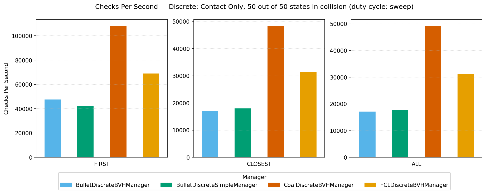

# tesseract_collision_benchmarks

Throughput benchmarks for Tesseract's collision backends. Every backend is driven through the
same workload — a Panda 7-DOF arm in a cluttered world — and reported as **contact checks per
second**, so discrete backends can be compared against each other, against their continuous
(swept) counterparts, and against MoveIt's collision detectors.

## Executables

| Target | Compares | Output |
|---|---|---|
| `tesseract_collision_benchmarks` | Tesseract *and* MoveIt detectors | console only, no options |
| `tesseract_collision_benchmarks_only` | Tesseract only | console table **and** CSV, full CLI |

The MoveIt comparison needs `moveit_core` and takes no arguments — it runs one fixed workload.
Everything below describes `tesseract_collision_benchmarks_only`, which is the one to use for
day-to-day measurement.

## The workload

1. Load the Panda from `data/panda.urdf` and `data/panda.srdf`.
2. Exclude robot-vs-robot collisions, so only robot-vs-world contacts are measured.
3. `clutterWorld()` adds 50 random obstacles (convex meshes and boxes) as a single `world`
   collision object.
4. `findStates()` samples 50 random robot states that are *in collision* with that world.
5. Each measurement runs 1000 trials over those 50 states — **50 000 contact checks** — and
   divides by wall-clock time. Continuous runs sweep the 49 consecutive pairs those 50 states
   form, so they measure 49 000 checks. Under the default `--duty-cycle sweep`, trials advance to
   the next sampled state before every check; under `--duty-cycle repeat` a state is set once and
   re-tested every trial. See `--duty-cycle` below.

`trials` (1000) and `num_states` (50) are constants at the top of `main()`; change them there.

Four scenarios run, each at three contact test types (`FIRST`, `CLOSEST`, `ALL`):

- `Contact Only` — collision/no-collision, zero margin
- `Penetration Enabled` — also compute penetration depth
- `Distance (0.2 m) Enabled` — 0.2 m margin, compute distances
- `Distance (0.2 m) and Penetration Enabled` — both

Continuous mode runs the same four over the *consecutive pairs* those states form. Every scenario
label carries a `Discrete: ` or `Continuous: ` prefix saying which of the two it belongs to.

Managers benchmarked:

- discrete — `BulletDiscreteBVHManager`, `BulletDiscreteSimpleManager`, `FCLDiscreteBVHManager`,
  `CoalDiscreteBVHManager`
- continuous — `BulletCastBVHManager`, `CoalCastBVHManager`

## Command line

```
tesseract_collision_benchmarks_only [CSV_PATH] [--mode M] [--test-type T] [--seed N]
                                    [--manager NAMES] [--clone] [--duty-cycle D]
```

| Option | Default | Effect |
|---|---|---|
| `CSV_PATH` (positional) | `tesseract_collision_benchmark.csv` | where the CSV is written |
| `--mode`, `-m` | `both` | `discrete`, `continuous`, or `both` |
| `--test-type`, `-t` | `all-types` | restrict to `first`, `closest`, `all`, or run all three |
| `--seed`, `-s` | time-based | fixed RNG seed for the clutter and the sampled states |
| `--manager`, `-M` | all | comma-separated, case-insensitive **substrings** of manager names |
| `--clone` | off | clone the manager per state pair in continuous mode; implies `--duty-cycle repeat` unless `--duty-cycle` is given explicitly (see below) |
| `--duty-cycle`, `-d` | `sweep` | `repeat` (set a state once, re-test it every trial) or `sweep` (advance to the next sampled state before every check) |
| `--help`, `-h` | | print usage and exit |

Unknown options, missing flag values, and values outside the allowed set are errors, not warnings.

Notes worth knowing:

- **`--seed` is what makes runs comparable.** Without it the clutter and the sampled states differ
  every run, and so do the numbers. Use the same seed on both sides of any A/B.
- **`--manager` filtering is applied after the world and the states are generated**, deliberately:
  `clutterWorld()` and `findStates()` clone the first manager in the list, so filtering earlier
  would change which backend decides the workload. A filtered run therefore reproduces the
  unfiltered workload for a given seed, and `-M coal` is directly comparable to a full run.
  A filter matching no manager is an error listing the available names.
- **`--clone` only *clones* in continuous mode**, but its duty-cycle fallback (next bullet) applies
  to the whole run regardless of `--mode`. In continuous mode it clones the contact manager for
  every state pair instead of reusing one, which is how TrajOpt drives the managers; it measures
  setup cost that a reused manager amortises away.
- **`--clone` implies `--duty-cycle repeat` for the whole run, unless `--duty-cycle` is given
  explicitly — including under `--mode both`, where it also switches the discrete rows to
  `repeat` even though cloning never touches discrete mode.** Cloning models TrajOpt cloning the
  manager once per state pair — 49 clones for 49 state pairs under `repeat`. Under `sweep` the loop
  order inverts to trial-outer/state-inner, so honouring `--clone` there would mean 1000 × 49 =
  49 000 clones, measuring manager construction rather than collision checking. A bare `--clone`
  therefore falls back to `repeat` instead of hitting that problem, and the startup log names the
  fallback (`Duty cycle: repeat (implied by --clone)`) so it is visible rather than silent. The
  implication is deliberately global rather than scoped to continuous mode: scoping it would let a
  single `--mode both --clone` run emit discrete rows under `sweep` and continuous rows under
  `repeat` in the same CSV, breaking the one-run-one-duty-cycle invariant that the `duty_cycle`
  column, the plot script's mixed-duty-cycle refusal, and external analysis scripts all rest on. A
  whole run under one labelled duty cycle is worth more than avoiding this surprise. An explicit,
  contradictory `--clone --duty-cycle sweep` is still rejected — see below.
- **`--duty-cycle` picks which bound on broadphase cost you measure, not a trajectory
  simulation, and `sweep` is the default because it is the shape real callers have.** Tesseract's
  own `checkTrajectoryState`/`checkTrajectorySegment` and TrajOpt's
  `SingleTimestepCollisionEvaluator::CalcCollisions` both do exactly one full transform update per
  `contactTest` — that is `sweep`. `repeat` has no real caller: it sets a sampled state once and
  re-tests it unchanged, so all but its first check per state skips the broadphase update
  entirely. `sweep` visits a fresh, independent sampled state on every check, so broadphase churn
  and warm-start invalidation are both maximal — it is an **upper bound** on update cost, not a
  simulation of one, because the 50 sampled states are independent configurations rather than
  small steps along a trajectory; a real trajectory moves in smaller increments and costs less.
  Choosing `repeat` instead inflates every other share by roughly 3× relative to `sweep` (measured:
  coal discrete Contact Only ran 142 751 checks/s under `repeat` vs 48 991 under `sweep`, same
  seed), and in one cast scenario it inverts which backend looks faster. The CSV's `duty_cycle`
  column records which one actually produced a row (see below) — concatenating or plotting CSVs
  from different duty cycles together is still a mixing hazard, which is why the plotting script
  refuses to do it.

## CSV output

```
scenario,manager,mode,checks_per_second,total_num_checks,num_contacts,duty_cycle
```

| Column | Meaning |
|---|---|
| `scenario` | `Discrete: ` or `Continuous: ` plus the scenario name; discrete rows end in `N out of M states in collision`, continuous rows in `N state pairs` |
| `manager` | contact manager name |
| `mode` | contact test type: `FIRST`, `CLOSEST` or `ALL` |
| `checks_per_second` | the measurement |
| `total_num_checks` | `trials × states` — 50 000 discrete, 49 000 continuous |
| `num_contacts` | contacts from the **final** check only |
| `duty_cycle` | `repeat` or `sweep` — the **effective** duty cycle that produced the row, not necessarily the requested one (a bare `--clone` records `repeat`; older CSVs from before this column existed have none) |

Two traps in that table:

- The `mode` column holds the *contact test type*, not the `--mode` setting. Whether a row is
  discrete or continuous is the prefix on `scenario`.
- `num_contacts` is not a total across the run — it is whatever the last check reported. Treat it
  as a sanity signal that the scenario really is colliding, and ignore it otherwise.

One row is written per scenario × test type × manager, so a default run produces
4 × 3 × 4 = 48 discrete rows plus 4 × 3 × 2 = 24 continuous rows.

## Plotting

```
scripts/plot_benchmark_csv.py results.csv --output-dir plots/
```

Requires `pandas` and `matplotlib`. It writes one grouped bar chart per scenario as
`checks_per_second_<scenario>_<duty_cycle>.png`, plus a combined
`checks_per_second_all_scenarios_<duty_cycle>.png`. Each figure has one subplot per contact test
type, one bar per manager, using the mean of `checks_per_second` where a scenario/type/manager
appears more than once. Colours are fixed per manager, so they hold across figures and across runs
that filtered with `--manager`, and only the managers that ran in a scenario are drawn for it.

- **The `duty_cycle` column keeps different runs from being averaged together silently.** The
  script refuses to plot a CSV that mixes duty cycles — the error names the values it found and
  tells you to filter the file first — and prints the effective duty cycle in every figure title,
  so a plot is never more ambiguous than the CSV it came from. A CSV from before the `duty_cycle`
  column existed still plots; its title says `duty cycle: unrecorded` and its filenames carry no
  suffix, so old recorded baselines keep their existing names.

The script is installed to `share/tesseract_collision_benchmarks/scripts`.

### Example

```
tesseract_collision_benchmarks_only results.csv --seed 42
scripts/plot_benchmark_csv.py results.csv --output-dir plots/
```



Two things to keep in mind when reading it. **Each subplot carries its own y-axis scale** — the
`FIRST` axis here reaches 110 000 while `CLOSEST` and `ALL` stop near 50 000, so bar heights are
only comparable within a subplot. And only managers that produced rows for that scenario are
drawn, which is why the cast managers are absent from a discrete scenario.

Absolute numbers are machine-specific; these came from an i9-13950HX under WSL2. Only compare
runs from the same machine, and pass the same `--seed` to both.

## Data

`data/` holds the Panda description (`panda.urdf`, `panda.srdf`), the contact manager plugin
configuration (`contact_manager_plugins.yaml`), and `benchmark_data_v2.ods` with previously
recorded results. That file predates the `duty_cycle` column and was recorded under the old
`repeat`-only behaviour — treat its numbers as `repeat`, not `sweep`, and do not compare them
against a current default run without accounting for the roughly 3× gap between the two (see
`--duty-cycle` above).
