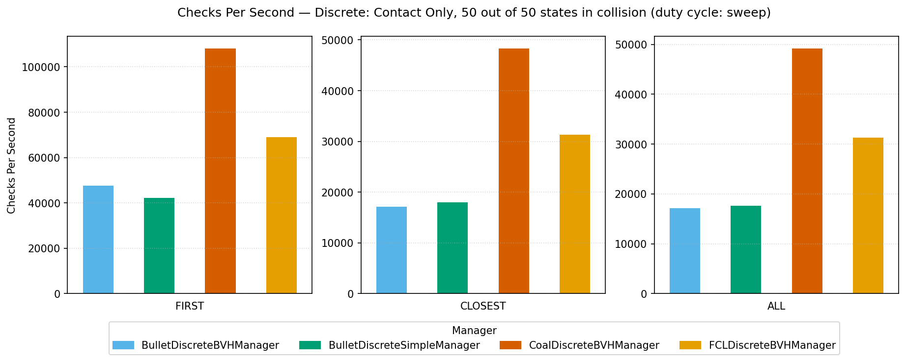

# tesseract_collision_benchmarks

Throughput benchmarks for Tesseract's collision backends. Every backend is driven through the
same workload — a Panda 7-DOF arm in a cluttered world — and reported as **contact checks per
second**, so discrete backends can be compared against each other, against their continuous
(swept) counterparts, and against MoveIt's collision detectors.

## Executables

| Target | Compares | Output |
|---|---|---|
| `tesseract_collision_benchmarks` | Tesseract *and* MoveIt detectors | console only, no options |
| `tesseract_collision_benchmarks_only` | Tesseract only | console table **and** CSV, full CLI |

The MoveIt comparison takes no arguments — it runs one fixed workload. Everything below describes
`tesseract_collision_benchmarks_only`, which is the one to use for day-to-day measurement.

## Running

Both executables are built by the same package, which requires `moveit_core` even though only the
MoveIt comparison links it. They are installed to the package's `bin/` directory.

Run them from a sourced workspace:

```
source install/setup.bash
tesseract_collision_benchmarks_only results.csv --seed 42
```

Every input is loaded through a `package://` URL, resolved via `TESSERACT_RESOURCE_PATH`,
`ROS_PACKAGE_PATH` or `AMENT_PREFIX_PATH`: the Panda description from this package's `data/`, and
the clutter's convex meshes from `moveit_resources_panda_description`. So `moveit_resources` must
be installed at run time as well. An unsourced run logs `Failed to find package resource` and
then crashes.

A default run takes about 11 minutes (646 s on the machine below, `--seed 42`), so allow for that
in any timeout. For a quick check, narrow it: `-m discrete -t first -M coal --seed 42` writes 4
rows in about 7 s.

## The workload

1. Load the Panda from `data/panda.urdf` and `data/panda.srdf`.
2. Exclude robot-vs-robot collisions, so only robot-vs-world contacts are measured.
3. `clutterWorld()` adds 50 random obstacles (convex meshes and boxes) as a single `world`
   collision object.
4. `findStates()` samples 50 random robot states that are *in collision* with that world.
5. Each measurement runs 1000 trials over those 50 states — **50 000 contact checks** — and
   divides by wall-clock time. Continuous runs sweep the 49 consecutive pairs those 50 states
   form, so they measure 49 000 checks. A `trajectory` run walks more pairs and makes
   proportionally fewer passes, which holds the discrete count at 50 000 exactly. Continuous walks
   one pair fewer than it has states, so it always falls one check per pass short of 50 000 — a
   whole 1000 checks under `sweep`, but only 100 at `--waypoints 10`, giving 49 900. Two
   continuous runs at different waypoint counts therefore differ by less than 1000 checks, 1.8 % at
   `--waypoints 10`; the discrete ones do not differ at all. Under the default `--duty-cycle
   sweep`, trials advance to the next sampled state before every check; under `--duty-cycle
   repeat` a state is set once and re-tested every trial. See `--duty-cycle` below.

`trials` (1000) and `num_states` (50) are constants at the top of `main()`; change them there.

Four scenarios run, each at three contact test types (`FIRST`, `CLOSEST`, `ALL`):

- `Contact Only` — collision/no-collision, zero margin
- `Penetration Enabled` — also compute penetration depth
- `Distance (0.2 m) Enabled` — `--margin` metres (default 0.2), compute distances
- `Distance (0.2 m) and Penetration Enabled` — both

The two distance labels carry the margin the run actually used, so `--margin 0.001` writes
`Distance (0.001 m) Enabled`. The first two scenarios are defined by a zero margin and never move.

Continuous mode runs the same four over the *consecutive pairs* those states form. Every scenario
label carries a `Discrete: ` or `Continuous: ` prefix saying which of the two it belongs to.

Managers benchmarked:

- discrete — `BulletDiscreteBVHManager`, `BulletDiscreteSimpleManager`, `FCLDiscreteBVHManager`,
  `CoalDiscreteBVHManager`
- continuous — `BulletCastBVHManager`, `CoalCastBVHManager`

## Command line

```
tesseract_collision_benchmarks_only [CSV_PATH] [--mode M] [--test-type T] [--seed N]
                                    [--manager NAMES] [--clone] [--duty-cycle D]
                                    [--waypoints N] [--margin M]
```

| Option | Default | Effect |
|---|---|---|
| `CSV_PATH` (positional) | `tesseract_collision_benchmark.csv` | where the CSV is written |
| `--mode`, `-m` | `both` | `discrete`, `continuous`, or `both` |
| `--test-type`, `-t` | `all-types` | restrict to `first`, `closest`, `all`, or run all three |
| `--seed`, `-s` | random, not logged | fixed non-negative RNG seed for the sampled states |
| `--manager`, `-M` | all | comma-separated, case-insensitive **substrings** of manager names |
| `--clone` | off | clone the manager per state pair in continuous mode; implies `--duty-cycle repeat` unless `--duty-cycle` is given explicitly (see below) |
| `--duty-cycle`, `-d` | `sweep` | `repeat` (set a state once, re-test it every trial), `sweep` (advance to the next sampled state before every check), or `trajectory` (advance along a joint-space interpolation between consecutive sampled states before every check) |
| `--waypoints`, `-w` | `1` | interpolated configurations per segment, for `--duty-cycle trajectory` only; must divide the 1000 trials. `1` reproduces `sweep`. Rejected under any other duty cycle, including the `repeat` a bare `--clone` implies |
| `--margin` | `0.2` | collision margin for the two distance scenarios, in metres; must be non-negative and below 1e6. Quoted in those scenarios' labels |
| `--help`, `-h` | | print usage and exit |

Unknown options, missing flag values, and values outside the allowed set are errors, not warnings:
the run logs why and exits with status 1 before benchmarking anything.

Notes worth knowing:

- **`--seed` is what makes runs comparable.** Without it the sampled states differ every run, and so
  do the numbers. The clutter is generated from its own fixed seed and is the same in every run.
  Use the same seed on both sides of any A/B.
- **One pair of runs does not establish a difference.** Throughput varies between identical runs,
  so repeat each side of an A/B several times and interleave them (A, B, A, B) rather than running
  all of A first.
- **`--manager` filtering is applied after the world and the states are generated**, deliberately:
  `clutterWorld()` and `findStates()` clone the first manager in the list, so filtering earlier
  would change which backend decides the workload. A filtered run therefore reproduces the
  unfiltered workload for a given seed, and `-M coal` is directly comparable to a full run.
  A filter matching no manager that the selected `--mode` runs is an error listing the available
  names.
- **`--clone` only *clones* in continuous mode**, but its duty-cycle fallback (next bullet) applies
  to the whole run regardless of `--mode`. In continuous mode it clones the contact manager for
  every state pair instead of reusing one, which is how TrajOpt drives the managers; it measures
  setup cost that a reused manager amortises away.
- **`--clone` implies `--duty-cycle repeat` for the whole run, unless `--duty-cycle` is given
  explicitly — including under `--mode both`, where it also switches the discrete rows to
  `repeat` even though cloning never touches discrete mode.** Cloning models TrajOpt cloning the
  manager once per state pair — 49 clones for 49 state pairs under `repeat`. Under `sweep` the loop
  order inverts to trial-outer/state-inner, so honouring `--clone` there would mean 1000 × 49 =
  49 000 clones, measuring manager construction rather than collision checking. A bare `--clone`
  therefore falls back to `repeat` instead of hitting that problem, and the startup log names the
  fallback (`Duty cycle: repeat (implied by --clone)`) so it is visible rather than silent. The
  implication is deliberately global rather than scoped to continuous mode: scoping it would let a
  single `--mode both --clone` run emit discrete rows under `sweep` and continuous rows under
  `repeat` in the same CSV, breaking the one-run-one-duty-cycle invariant that the `duty_cycle`
  column, the plot script's mixed-duty-cycle refusal, and external analysis scripts all rest on. A
  whole run under one labelled duty cycle is worth more than avoiding this surprise. An explicit
  `--clone` with `--duty-cycle sweep` or `trajectory` is rejected whenever continuous mode runs;
  under `--mode discrete` nothing is cloned, so the combination is accepted.
- **`repeat` and `sweep` bound broadphase cost from below and above; `trajectory` nominally sits
  between them (but see the collision-content caveat below), and `sweep` stays the default because it is the shape real callers have.** Tesseract's
  own `checkTrajectoryState`/`checkTrajectorySegment` and TrajOpt's
  `SingleTimestepCollisionEvaluator::CalcCollisions` set transforms then run one `contactTest` —
  that is `sweep`. `repeat` has no real caller. `sweep`'s sampled states are independent
  configurations, so the jump between two checks is larger than any planner sees; `trajectory`
  interpolates between them in joint space, and `--waypoints` selects how far between the two
  bounds a run sits. Choosing `repeat` instead inflates throughput by roughly 3× relative
  to `sweep` (measured: coal discrete Contact Only ran 142 751 checks/s under `repeat` vs 48 991
  under `sweep`, same seed), and in one cast scenario it inverts which backend looks faster. The
  CSV's `duty_cycle` column records which one actually produced a row (see below) — concatenating
  or plotting CSVs from different duty cycles together is still a mixing hazard, which is why the
  plotting script refuses to do it.
- **A `trajectory` run's scenario label describes the sampled states, not the waypoints it
  walked, and the two differ in collision content.** The sampled states are all in collision by
  construction; interpolations between them need not be, and a contact test costs a different
  amount depending on whether a contact exists — `FIRST` exits at the first one. So part of any
  `trajectory`-versus-`sweep` difference is the changed collision content rather than the update
  frequency. The startup log reports how many walked waypoints collide at each margin the run
  uses, e.g. `Expanded 50 sampled states into 500 trajectory waypoints, 397 of them in collision
  at margin 0 and 500 at margin 0.2 m (surveyed with BulletDiscreteBVHManager)` (seed 42; the survey
  always uses the backend that sampled the states, whatever `--manager` selects) — a waypoint with no contact at zero margin can
  have one at the distance scenarios' margin, so one number would not describe all four
  scenarios. Labels stay keyed to the sampled population deliberately, so runs at different
  waypoint counts still join on the `scenario` column; what a run actually walked is in
  `total_num_checks`.
- **Continuous numbers recorded before the cast/static transform split are not comparable with
  numbers recorded after it.** The split is applied once per state pair outside the timed loop and
  issued as two bulk calls, which is the shape a caller such as TrajOpt already holds. Only a
  backend overriding the vector overloads gains from it — coal does, Bullet does not — so the
  change moved the gap between backends, not only the absolute rates.

## CSV output

```
scenario,manager,mode,checks_per_second,total_num_checks,num_contacts,duty_cycle
```

| Column | Meaning |
|---|---|
| `scenario` | `Discrete: ` or `Continuous: ` plus the scenario name; discrete rows end in `N out of M states in collision`, continuous rows in `N state pairs` |
| `manager` | contact manager name |
| `mode` | contact test type: `FIRST`, `CLOSEST` or `ALL` |
| `checks_per_second` | the measurement |
| `total_num_checks` | passes × configurations walked per pass (pairs, for continuous) — 50 000 discrete under every duty cycle; continuous 49 000 under `repeat` and `sweep`, and 50 000 − 1000/N under `trajectory-N` (49 900 at N = 10) |
| `num_contacts` | contacts from the **final** check only |
| `duty_cycle` | `repeat`, `sweep`, or `trajectory-N` where N is the waypoint count — the **effective** duty cycle that produced the row, not necessarily the requested one (a bare `--clone` records `repeat`; older CSVs from before this column existed have none). The waypoint count is part of the value because two trajectory runs at different step sizes are not comparable |

Two traps in that table:

- The `mode` column holds the *contact test type*, not the `--mode` setting. Whether a row is
  discrete or continuous is the prefix on `scenario`.
- `num_contacts` is not a total across the run — it is whatever the last check reported. Treat it
  as a sanity signal that the scenario really is colliding, and ignore it otherwise.

One row is written per scenario × test type × manager, so a default run produces
4 × 3 × 4 = 48 discrete rows plus 4 × 3 × 2 = 24 continuous rows.

## Plotting

```
scripts/plot_benchmark_csv.py results.csv --output-dir plots/
```

Requires `pandas` and `matplotlib`. `--output-dir` defaults to the current directory. It writes one
grouped bar chart per scenario as
`checks_per_second_<scenario>_<duty_cycle>.png`, plus a combined
`checks_per_second_all_scenarios_<duty_cycle>.png`. Each figure has one subplot per contact test
type, one bar per manager, using the mean of `checks_per_second` where a scenario/type/manager
appears more than once. Colours are fixed per manager, so they hold across figures and across runs
that filtered with `--manager`, and only the managers that ran in a scenario are drawn for it.

- **The `duty_cycle` column keeps different runs from being averaged together silently.** The
  script refuses to plot a CSV that mixes duty cycles — the error names the values it found and
  tells you to filter the file first — and prints the effective duty cycle in every figure title,
  so a plot is never more ambiguous than the CSV it came from. A CSV from before the `duty_cycle`
  column existed still plots; its title says `duty cycle: unrecorded` and its filenames carry no
  suffix, so old recorded baselines keep their existing names.

The script is installed to `share/tesseract_collision_benchmarks/scripts`.

### Example

```
tesseract_collision_benchmarks_only results.csv --seed 42
scripts/plot_benchmark_csv.py results.csv --output-dir plots/
```



Two things to keep in mind when reading it. **Each subplot carries its own y-axis scale** — the
`FIRST` axis here reaches 110 000 while `CLOSEST` and `ALL` stop near 50 000, so bar heights are
only comparable within a subplot. And only managers that produced rows for that scenario are
drawn, which is why the cast managers are absent from a discrete scenario.

Absolute numbers are machine-specific; these came from an i9-13950HX under WSL2. Only compare
runs from the same machine, and pass the same `--seed` to both.

## Data

`data/` holds the Panda description (`panda.urdf`, `panda.srdf`), the contact manager plugin
configuration (`contact_manager_plugins.yaml`), and `benchmark_data_v2.ods` with previously
recorded results. That file predates the `duty_cycle` column and was recorded under the old
`repeat`-only behaviour — treat its numbers as `repeat`, not `sweep`, and do not compare them
against a current default run without accounting for the roughly 3× gap between the two (see
`--duty-cycle` above).
